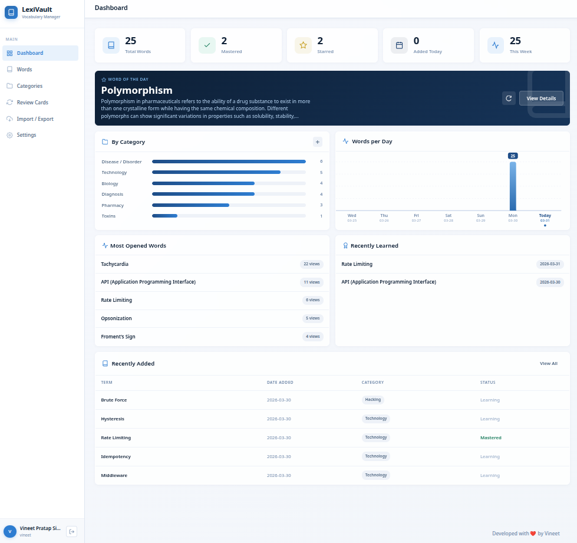

  
  <!-- You can replace the src below with your actual logo URL -->
  

  <h1>LexiVault</h1>
  
<b>Your Professional, Self-Hosted Vocabulary Management System</b>

  

    
    
    
  

  

    <a href="#features">Features</a> •
    <a href="#installation">Installation</a> •
    <a href="#-the-public-dictionary--api">Public API</a> •
    <a href="#-backup--restore">Backups</a> •
    <a href="#-contact">Contact</a>
  

---

**LexiVault** is a powerful, modern, and highly responsive vocabulary repository built as a **single-file PHP application**. It is designed for language learners, writers, students, and professionals who want a secure, self-hosted environment to store, organize, and review new words. 

Despite being contained in a single `index.php` file, LexiVault features a glassmorphism-inspired UI, flashcard reviews, automated daily email digests, a public dictionary API, and an auto-fetch integration with the Free Dictionary API.

## ✨ Key Features

*   **🚀 Zero-Configuration Deployment:** The entire application lives in one `index.php` file. Just drop it into your web server, and the built-in Setup Wizard handles the database creation and admin user setup.
*   **📖 Dictionary API Integration:** Instantly auto-fetch definitions, parts of speech, and pronunciations for new words using the Free Dictionary API.
*   **🧠 Flashcard Review Mode:** Test your memory with an interactive, flippable review card UI. Includes text-to-speech (TTS) auto-play pronunciation and mastery tracking.
*   **📊 Insightful Dashboard:** Track your learning progress with beautiful charts (daily additions, category breakdowns), Word of the Day (WOTD), and recently learned lists.
*   **🗂️ Advanced Organization:** Group words into custom Categories (with colors), assign tags, set difficulty levels (Easy/Medium/Hard), and log source references.
*   **📝 Rich Text Definitions:** Format your definitions and personal notes beautifully using the integrated Quill.js rich text editor.
*   **🔍 Public Dictionary & API:** Enable a public-facing dictionary search for guests (`?page=public_search`). Includes an autocomplete endpoint and a `?pbw=` JSON/HTML API.
*   **📧 Automated Daily Digests:** Configure native SMTP to receive daily vocabulary summary emails containing your latest words right to your inbox.
*   **📦 Full Backup & Restore:** Import and export your entire vocabulary vault in JSON, CSV, or raw SQL formats.
*   **⚡ Modern UI/UX:** A fast, responsive, app-like interface with grid/list view toggles, bulk action toolbars, auto-saving drafts, and Toast notifications.

---

## 🛠️ Technical Stack

*   **Backend:** PHP 8.x
*   **Database:** MySQL / MariaDB (via PDO)
*   **Frontend:** Vanilla JavaScript, HTML5, CSS3 (No heavy frontend frameworks)
*   **Rich Text:** Quill.js (loaded via CDN)
*   **Fonts:** Google Fonts (Noto Sans)

---

## Screenshot 

---

## 🚀 Installation

LexiVault is designed to be ridiculously easy to install.

### Prerequisites
*   A web server (Apache, Nginx, etc.)
*   PHP 8.0 or higher (with PDO MySQL extension enabled)
*   A MySQL or MariaDB database server

### Step-by-Step Setup

1.  **Download the App:** Download the `index.php` file and place it in your web server's public directory (e.g., `/var/www/html/lexivault` or `htdocs`).
2.  **Access the App:** Open your web browser and navigate to the location where you placed the file (e.g., `http://yourdomain.com/lexivault/`).
3.  **Setup Wizard:** 
    *   You will be greeted by the built-in Setup Wizard.
    *   **Step 1:** Enter your MySQL Database credentials (Host, Port, Database Name, User, Password). The wizard will automatically test the connection and create the database if it doesn't exist.
    *   **Step 2:** Create your Administrator account (Name, Username, Password).
4.  **Done!** Log in with your new credentials and start building your vault.

*(Note: LexiVault automatically creates a protected `lexivault_data/` folder in the same directory to store the `system.json` configuration file.)*

---

## 📱 Application Modules

### Dashboard
Provides a high-level overview of your vocabulary journey. View total words, mastered words, starred words, and visual graphs detailing your learning activity over the last 7 days.

### Word Library
Your main repository. Supports both **Grid View** (card-based) and **Table View** (list-based). 
*   Search instantly across terms, definitions, and notes.
*   Filter by Category, Word Class, Tag, Date, Difficulty, and Status.
*   Execute **Bulk Actions** (Categorize, Master, Star, Delete) using the floating action bar.

### Categories
Create unique categories (e.g., *Science, Literature, Foreign Language*) and assign them custom colors for easy visual identification across the app.

### Review Cards
A distraction-free environment to study. Filter the cards by category or status (e.g., "Not Mastered"). Flip the cards to reveal definitions and use the built-in Text-to-Speech to hear the pronunciation.

### Settings & Daily Digest
Configure your global words-per-page, enforce strict timezones, and set up your SMTP credentials. Once configured, LexiVault can automatically send you a beautiful HTML email daily containing your most recent words.

---

## 🌐 The Public Dictionary & API

LexiVault includes a public-facing portal allowing non-logged-in users to search your vocabulary database.

*   **Public Interface:** Navigate to `?page=public_search` for a clean, standalone search interface complete with recent search history and auto-complete.
*   **REST API Endpoint:** Developers can fetch word data externally using the `?pbw=` parameter suite.

### 🛠️ API Parameters
| Parameter | Type | Description |
| :--- | :--- | :--- |
| `pbw` | `string` | The search term (e.g., `?pbw=Ephemeral`). |
| `format` | `string` | Output format: `html` (default) or `json`. |
| `category` | `int/string`| Filter by exact Category ID or Category Name. |
| `word_type` | `string` | Filter by Word Class / Part of Speech (e.g., `Noun`). |

### 💡 API Examples
- **Basic JSON Search:** `?pbw=Ephemeral&format=json`
- **View All words in a category** `?pbw&category=Biology`
- **View All words in word type** `?pbw&word_type=Noun`
- **Fetch by Category:** `?pbw=Hi&category=General`
- **Type Filter:** `?pbw&word_type=Adjective&format=html`
- **Seach word by combined filter:** `?pbw=Hi&category=General&word_type=Noun`

> *Note: If an authenticated admin clicks a public search link, LexiVault intelligently redirects them to their internal, editable word library.*

---

##  Backup & Restore

Never lose your data. Head over to the **Import / Export** tab to manage your backups.

*   **Export:** Download your vault as a `.json` file (best for LexiVault migrations), a `.csv` file (best for Excel/Google Sheets), or a raw `.sql` backup.
*   **Import:** Easily restore your vault from a previously generated LexiVault JSON file, or completely overwrite your database using a raw SQL dump.

---

## 🤝 Contributing

Contributions, issues, and feature requests are welcome!
Feel free to check issues page if you want to contribute.

1. Fork the Project
2. Create your Feature Branch (`git checkout -b feature/AmazingFeature`)
3. Commit your Changes (`git commit -m 'Add some AmazingFeature'`)
4. Push to the Branch (`git push origin feature/AmazingFeature`)
5. Open a Pull Request

---

## 📝 License

This project is licensed under the MIT License - see the LICENSE file for details.

---

## 📬 Contact

Developed with ❤️ by **Vineet**.

*   **Email:** psvineet&zohomail.in 
*   **GitHub:** @vptsh

---

  <i>Your Personal Vocabulary Repository.</i>

